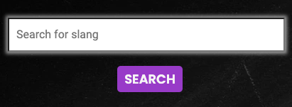

#[Development](#development)

## Table of contents
1. [Project Board](##project-board)
2. [Defensive Programming](#defensive-programming)
        -[Password Hashing and Validation](#password-hashing-and-validation)
        -[Form Validation](#form-validation)
        -[Unique Username Checks](#unique-username-checks)
        -[Login Required Decorator](#login-required-decorator)
        -[User Ownership Checks](#user-ownership-checks)
        -[Flash Messages and Feedback](#flash-messages-and-feedback)
        -[Error Handling and Redirects](#error-handling-and-redirects)
        -[Environment Variables for Sensitive Data](#environment-variables-for-sensitive-data)
3. [Fuzzywuzzy](#fuzzywuzzy)
4. [Status Badge](#status-badge)
5. [Action Buttons](#action-buttons)
6. [Modals](#modals)
        -[Bootstrap](#bootstrap)
        -[script.js](#scriptjs)
7. [Box Shadows](#box-shadows)
8. [Bug Fixes](#bug-fixes)
        -[Confirmation Modal](#confirmation-modal)
        -[Heroku Tail Log Error](#heroku-tail-log-error)
        -[Safari Render Issue](#safari-render-issue)
        -[JS Hint](#js-hint)
        
------

## Project Board

* Throughout the development of this project tasks were managed using a git hub project board within the repository. This enables ordering tasks by priority and progress status. 

* Using the project board provides a great visual prioritisation and task management aid. This was essential for running a project with lots of files at various stsges of development. 

* The github project board was particuarly useful for highlighting external sourcing tasks with attached thougth and ideas around that which can be edited quickly and easily. The project board can be seen below. 

------
## Defensive Programming

### Password Hashing and Validation
### Form Validation
### Unique Username Checks
### Login Required Decorator
### User Ownership Checks
### Flash Messages and Feedback
### Error Handling and Redirects
### Environment Variables for Sensitive Data

------
## Fuzzywuzzy

* After reviewing the search function it did not align well with all user stories. This is because the nature of the slang words, their definitions and origins mean that they are often not spelled as you might expect. For example a lot of newer slangs are adopted and popularised from youtubers. 

* The key objective of the app is to help users find the words and their associated meanings. It is logical to assume that you may not know how to spell a slang word correctly in order to find it. 

* There is a clear need to allow some margin for error from the user when taking inputs and matching them to a document in mongoDB.  

* Research suggested several options for text operators, but the best operator for the solution that offers an adjustable threshold control for matching and filtering was [Fuzzywuzzy](https://pypi.org/project/fuzzywuzzy/). This will be initially set to 80% before testing. 

* The final fuzzywuzzy code within the app route can be seen below. 

------

## Status Badge

* In the initial design it was planned that there would be a status badge in the admin dashboard next to the pending slang list item. 

* After building the admin dashboard and styling as per the [wireframe](documents/wireframes/mobile_admin.png), the section seemed cluttered. 

* As well as the red, green and purple buttons there was then an additional yellow pending badge that looked like it could be easily mistaken for a button. This was noticed from feedback from the school users testing the app. Please see [TESTING.md](TESTING.md). 

------

## Action buttons

* After the status badge was removed the buttons that update, approve or delete the pending slangs were moved into their own space underneath the pending slang list item. 

* This makes them much easier to style and adjust layout and style for media queries more easily. 

* They were grouped into a section called 'action' buttons. This makes the create, update and delete functionalities of CRUD very clear and does not get lost within a list item as before. 

* This is important as the admin dashboard is key to maintaining the quality of the database content. The revised button layout can be seen below. This can be compared to the original wireframe [here](documents/wireframes/mobile_admin.png). 

------

## Modals

### Bootstrap

* Initially the project was built using vanilla javascript and styled in the style.css. There were lots of issues removing the backdrop that greyed out the screen behind the modal. An example of this can be seen [here](documents/development/backdrop_fix.png). 

* As there was one script.js file executing all of the functions on various pages this may have been causing the problem. 

* To minimise errors when the script.js file was executing the decision was made to use [Bootstrap 5.3](https://getbootstrap.com/) own modal classes and layout for the modals, thus handling the modal backdrop on closure automatically. 

* This hasn't impacted the design aesthetically but has made the code more reliable and freed up the script.js file. 

### script.js

* During development, after switching to [Bootstrap 5.3](https://getbootstrap.com/) modal classes, there was an error log in the console. This pointed to the edit modal. 

* Initially it wasnt clear what was causing this but it was only occuring on the index page. 

* This subsequently stopped the footer date from updating which is where the issue was first noticed within the browser. 

* This was useful as it pointed out where the script.js file stopped running.  

* The issue was that the single script.js was trying to run different functions across different template pages. When the script was being executed on a template that wasn't relevant, it would throw an error and not run the rest of the script. The app was loosing functionality due to this. 

* The decision was made to add another JavaScript file to run the edit modal functionality specifically. This could the be linked to the admin dashboard template directly so that the line of code that was causing the issue would only run for the admin dashboard template. 

* This fixed the bug and restored original functionality. The console error that was shown for the script.js file can be seen below. 

------

## Box Shadows

* The initial design when created seemed a little flat in areas. As the design is meant to represent a chalkboard type effect this didnt feel too engaging or give much dimension to the user interface. 

* A box shadow was added to the slang word search boxes with a white grey 50% opacity to give a partially rubbed out chalk look. 

* This effect looks much more appealing to all users and fits with the user stories. The new effect can be seen below.

------

## Bug Fixes

### Confirmation Modal

* There was an issue with the cancel button in the confirmation modal. After lots of testing the only way to fix this was to declare the confirm button variable in the html file. This allowed the file to run and exeecute as expected. This does however mean that the variable shows as undefined in the js hint testing. This is expected and has been logged. This can be seen [here](documents/testing/jshint_testing.png). 

### Heroku Tail Log Error

* During the development of the project, upon reviewing the deployed app on heroku, the files were not rendering and executing as expected causing an error. This was logged in heroku's system error logs as a '--tail' error. This can be seen below. 

* Although heroku informs you of the error code, it doesnt give any clues to what this may be. After researching on stack overflow, chat gpt and searcging through google answers it pointed to an error with requirements and a potential missing installation. 

* After checking through the requirements.txt and current installations it appeared gunicorn was missing. This was reinstalled and fixed the bug. 

### Safari Render Issue

* During development safari was used to view the deployed site. The heroku app rendered but a lot of the styling was not visible. 

* This pointed initially to an issue with the styles and the stylee.css file. 

* All script links were checked multiple times and an error could not be found. 

* Code Institute support team verfified that there were no issues with the app in their browsers whic were not safari. 

* After checking the app in chrome it showed there was an issue with the app and safari specifically. The app was checked with different versions of safari on other devices and worked as expected. 

* The version of safari on the mac used was unable to be updated due to age of machine and the issue points to the version of safari not supporting the app deployed in heroku. It did render the gitpod port rendering. The issue can be seen [here](documents/development/safari_render_issue.png). 

* The error logged can be seen below. 

### JS Hint

* An bug occured during deveopment with the home page not linking correctly. This was due to jinja templating and files not linking correctly. 

* In order to fix it the part of the script that was causing the issue was directly put in script tags into the html. 

* This solved the isue but after problem solving this was the only was to fix the bug so this setup has remained. 

* You can read more about how this was reflected in testing in [testing](TESTING.md). 

