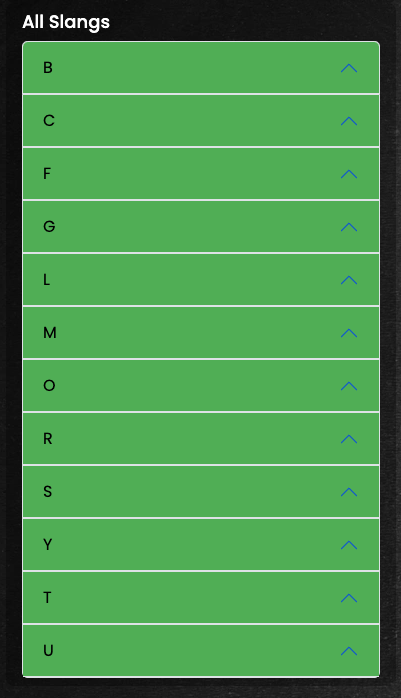
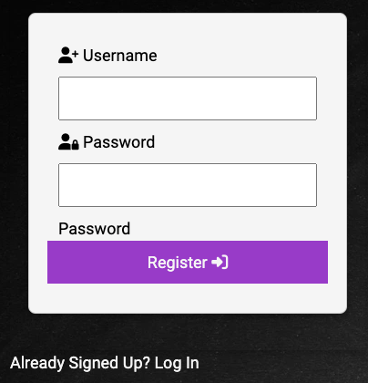
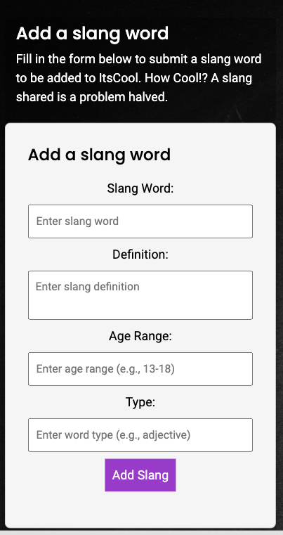
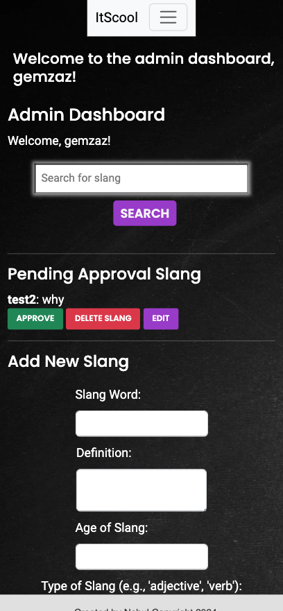
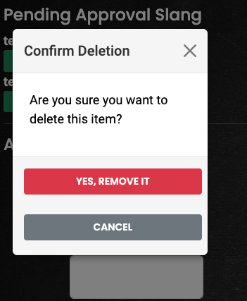
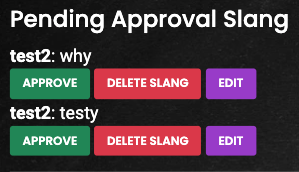
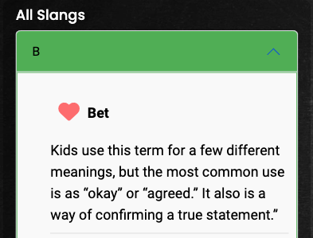
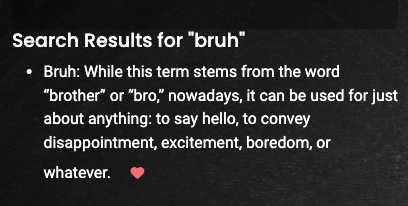
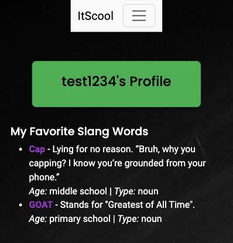
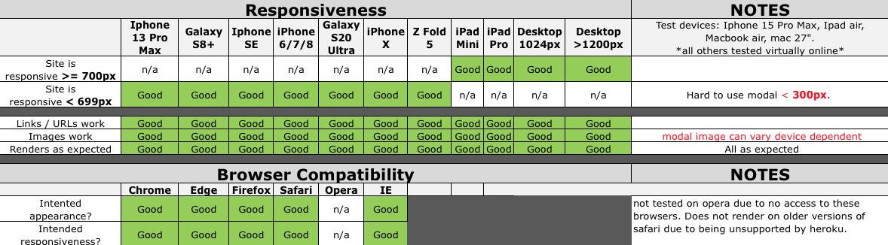

Welcome to

#  ItsCool 


View the live project [here!](https://itscool-project-b4212f408fa2.herokuapp.com/index)

## Table of Contents
1. [**UX**](#ux)

   * [**Project Goals**](#project-goals)
   * [**User Goals**](#user-goals)
   * [**Entity Reltionship Diagram**](#entity-relationship-diagram)
      - [**Lucid Charts**](#lucid-charts)
   * [**Design Choices**](#design-choices)
      - [**Colour Scheme**](#colour-scheme)
      - [**Typography**](#typography)
      - [**Imagery**](#imagery)
   * [**Wireframes**](#wireframes)

2. [**Features**](#features)

   * [**Navigation Bar**](#navigation-bar)
   * [**Search Slang Function**](#search-slang-function)
      - [**Input and Button**](#input-and-button)
      - [**Search Results**](#search-results)
   * [**Accordion**](#accordion)
   * [**Sign Up**](#sign-up)
   * [**Log In**](#log-in)
   * [**Logout**](#log-out)
   * [**Add Slang Word**](#add-slang-word)
   * [**Delete Slang Word**](#delete-slang-word)
   * [**User Dashboard**](#user-dashboard)
   * [**Admin Dashboard**](#admin-dashboard)
      - [**Search Function**](#search-function)
      - [**Pending Slangs**](#pending-slangs)
      - [**Action Buttons**](#action-buttons)
      - [**Add Slang Form**](#add-slang-form)
   * [**Favourites**](#favourites)
      - [**Favourite Button**](#favourite-button)
      - [**Favourites List**](#favourites-list)
   * [**Footer**](#footer)
   * [**404 Page**](#404-page)
   * [**Error Handling**](#error-handling)
   * [**Features left to implement**](#features-left-to-implement)

3. [**Technologies Used**](#technologies-used)
   * [**Front-End Technologies**](#front-end-technologies)
   * [**Back-End Technologies**](#back-end-technologies)

4. [**Testing**](#testing)

5. [**Deployment**](#deployment)

   * [**GitHub Pages**](#github-pages)
   * [**Forking The GitHub Repository**](#forking-the-github-repository)
   * [**Making A Local Clone**](#making-a-local-clone)

6. [**Credits**](#credits)

   * [**Content**](#content)
   * [**Media**](#media)
   * [**Code**](#code)
   * [**Acknowledgements**](#acknowledgements)

------

## UX

### User Stories

#### Project Goals

The target audience is for children, teenagers and adults trying to determine the definition, spelling, origin and appropriation of school slang words used in the UK and to add to the current ItsCool community dictionary.

#### User Goals

"**_As a guest user, I would like to_** _______________"

✅  browse through the slang terms listed alphabetically so I can see all the terms that are available.

✅  click on slang terms to view their definitions and sample usage, so I can understand the meaning and context.

✅  search for slang terms by typing keywords or phrases, so I can quickly find the slang term I'm interested in.

✅  browse slang terms by selecting a letter from A-Z, so I can easily find terms that start with a specific letter.

✅  as a new user, create an account by providing a username and password, so I can log in and use additional features.


"**_As a registered user, I would like to_** _______________"


✅  as a returning user, I want to log in with my username and password, so I can access my account.

✅  as a logged-in user, I want to log out of my account, so I can ensure my account remains secure on shared devices.

✅  get immediate feedback to know if I have signed up, logged in or signed out.

✅  access a user dashboard when logged in.

✅  request to add new slang terms and definitions, so I can expand the slang dictionary and share knowledge.

✅  request to edit slang terms I’ve added to correct or improve definitions, ensuring the information stays accurate and up-to-date.

✅  request to delete slang terms that are no longer relevant or are duplicates, so the dictionary remains clean and useful.

✅   be able to save my favourite slang words to a favourites list in my user dashboard.

"**_As an student user, I would like to_** _______________"

✅  Learn About Common School Slang:
    As a student, I want to browse slang terminology so I can understand the informal language and slang used by peers in the school environment and elsewhere.

✅  Contribute School-Specific Slang:
    As a student, I want to contribute slang that’s specific to my age, school type or region, so I can share it with other students who may find it relevant or interesting.

✅  See Slang Organized Alphabetically:
    As a student, I want to see slang words organized by their first letter, so I can easily find terms that I hear frequently.

✅  Report Incorrect or Inappropriate Content:
    As a student, I want to report slang entries that are incorrect, outdated, or inappropriate, so I can help maintain a positive and accurate dictionary.

✅  Save Favourite Slang:
   As a student, I want to be able to save my favourite slang words to a favourites list in my user dashboard.

"**_As a teacher or parent, I would like to_** _______________"

✅  Understand Student Language:
    As a teacher or parent, I want to look up slang terms and definitions, so I can understand the language students are using in social and school settings.

✅  View Related Terms and Meanings:
    As a teacher or parent, I want to be able to search for slang words that i have heard and want to find out their corresponding definition and appropriateness.

✅  Browse by Letter or Category:
    As a teacher or parent, I want to browse slang by letter to find terms more easily and understand common slang patterns.

✅  Save Relevant/Favourite Slang:
    As a teacher or parent, I want to be able to save slang words to a favourites list in my user dashboard that i can come back to as a reference point.


"**_As an administrator, I would like to_** _______________"

✅  review slang terms submitted by users before they are published, so I can ensure quality and appropriateness.

✅  delete any slang term to correct inaccuracies, enforce content guidelines, and remove inappropriate entries.

✅  edit, delete or approve pending approval requests from users requesting a slang word to be added to the app via an admin dashboard.

✅  use a form to add new slang words to the app.

✅  navigate easily to the admin dashboard via a navbar. 

##### back to [top](#table-of-contents)


### Entity Relationship Diagram

   **Lucid Charts**

   * The starting point for the entity relationships was drawn up as a entity relationship diagram using [lucid charts](https://www.lucidchart.com/).

   * The initial ERD (entity relationship diagram) is very basic which will be built upon as the project develops in the future. The ERD is shown below.


### Design Choices

   * Mobile first, single column responsive design. 

#### Colour Scheme

 The global colour selection for ItScool is shown below.

   * Primary colour: Purple #9932cb

   * Secondary colour: #6c757d

   * Primary text colour: #f5f5f5

   * Secondary text colour: #000000

#### Typography

   * The Poppins google font is to be used with a fall back font of sans-serif should the font fail to load. It is used for the header, navbar, headings and footer. 

   * The Roboto font google font is used for the body text with a fall back font of sans serif should it fail to load. This font has a fun and slightly dramatic comic characteristics whilst remaining legible. 

#### Imagery

[Canva](https://www.canva.com/) was used to create the background and title images for the project. The homepage title image is shown below. The 404 page title image can be seen [here](static/images/ItsCool404_img.webp).


##### back to [top](#table-of-contents)


### Wireframes

Wireframes were created using [Balsamiq](https://balsamiq.com/) and can all be found in the [wireframes folder](documents/wireframes).
Below is the mobile view wireframe of the homepage.


------

The wireframe showing the homepage on a tablet is shown below.


------

The wireframe showing the homepage on a desktop is shown below.


------

The mobile view [login](documents/wireframes/mobile_login.png) and [sign up](documents/wireframes/mobile_signup.png) wireframes can be viewed in the [wireframes folder](documents/wireframes).

------

The mobile view of the [add slang](documents/wireframes/mobile_add_slang.png), [delete slang](documents/wireframes/mobile_delete_slang.png) and [user dashboard](documents/wireframes/mobile_user_dashboard.png) wireframes can be viewed in the [wireframes folder](documents/wireframes).

------

The wireframe showing the admin dashboard on a mobile device is shown below.


##### back to [top](#table-of-contents)
------

## Features

### Existing Features

#### Navigation Bar

   * There is an expandable navbar on mobile and tablet devices shown below.


   * The navbar on desktop sized screen is fixed and takes up between 30% and 80% of the width of the screen depending on screen size, as shown Below.


#### Search Slang Function

##### Input and Button

   * The search function is accessible to all users including non registered users.

   * The search function is underneath the welcome container on the index page. It takes the input from the user.

   * Users can type a slang word into the search box and any matching results will be displayed underneath in the search results area. The search function can be seen below.

   * Meets **CRUD** functionality requirements (READ).


##### Search Results

   * Search results are displayed in the search results container underneath the search form container. 

   * Results are matched using fuzzywuzzy. Please refer to [DEVELOPMENT.md](DEVELOPMENT.md) for further details about fuzzywuzzy.

   * The slang word, its definition, age group and word type are displayed in the search results area.

   * There is immediate, automatic user feedback informing the user with a flash message if no matches are found. This can be seen below.

   * Meets **CRUD** functionality requirements (READ).

   

#### Accordion

   * Located on the index.html is a bootstrap accordion grouping slang terms and their definitions by the letter in which they start with.

   * The header for each letter expands revealing all slangs starting with that letter beneath it.

   * Meets **CRUD** functionality requirements (READ).



#### Sign Up

   * Within the sign up page there is a sign up form which takes a username and password to register a user on the database.

   * The sign up page is accessible from both the nav bar and links underneath the login and logout page.<br>

   * Meets **CRUD** functionality requirements (CREATE).<br>




#### Log In

   * Within the log in page there is a log in form that takes a registered users username and password. The user is notified of login status via a flash message.<br>

   * The login page is accessible from the link in the nav bar, underneath the signup form and also appears after successfully logging out via the navbar log out link.<br>

   * Meets **CRUD** functionality requirements (READ).<br>


#### Log Out

   * The logout link is accessible from the navbar by either expanding it using the 'hamburger' icon on smaller devices or from the fixed width navbar on larger screens. This can be viewed [here](documents/readme/logout.png).

##### back to [top](#table-of-contents)


#### Add Slang Word

   * There is a add slang page where registered and logged in users can request to add slang words to the dictionary pending admin approval.<br>

   * This can also be submitted to amend existing slangs.<br>

   * Meets **CRUD** functionality requirements (CREATE, UPDATE).<br>



#### Delete Slang Word

   * There is a add delete slang page where registered and logged in users can request to remove slang words from the dictionary pending admin approval.<br>

   * This can also be submitted to amend existing slangs.<br>

   * Meets **CRUD** functionality requirements (UPDATE, DELETE).<br>


#### User Dashboard

   * There is a dashboard that displays the users profile and a list of favourited slang words appear.<br>

   * The user can navigate here upon logging in successfully using their username and password on the login page.
   This can be viewed [here](documents/readme/user_dashboard.png).<br>

   ** Meets **CRUD** functionality requirements (UPDATE).<br>


#### Admin Dashboard

   * Admin users are able to access an admin dashboard via the navbar when logged in successfully.<br>


   ##### Search Function

   * Here admin can search for a slang word to delete from the dictionary. There is a search input box and a search button which then produces results found.<br>

   * There is a delete button next to the slang results which when clicked triggers the confirmation modal asking the admin user if they are sure they want to delete the item to minimise accidental or unwated deletion from the database.<br>

   * Meets **CRUD** functionality requirements (READ, DELETE).



   ##### Pending Slangs 

   * Within the dashboard there is a pending slangs section which displays slang words that have been subject to a removal request from registered users.<br>

   * Meets **CRUD** functionality requirements (CREATE, UPDATE, DELETE).



   ##### Action Buttons

   * There are 3 action buttons next to each pending slang. Each are critical in the management of the dictionary.<br>

   * A delete button allows the admin to delete the pending slang from the list meaning it will not be added. Before this action is executed a confirmation modal asks the user if they are sure they want to proceed to prevent accidental or unwanted deletion.<br>

   * An approve button allows the admin to approve the request to add a slang to the database.<br>

   * An edit button next to the pending slang allows the admin to edit a pending slang before approval. Clicking this button triggers the display of the edit modal where the input is taken from the admin to make changes to the pending slang.<br>

   * Meets **CRUD** functionality requirements (CREATE, UPDATE, DELETE).


   ##### Add Slang Form

   * There is a form located in the admin dashboard that allows an admin user to add a slang word to the dictionary without it going through the pending approval process.
   The admin dashboard can be seen below.<br>

   * Meets **CRUD** functionality requirements (CREATE, UPDATE, DELETE).


   #### Favourites

   ##### Favourite Button


   * A favourite button serves the function of allowing registered users to add their favourite slangs to a favourites list.<br>

   * The favourite buttons are located next to each slang in the accordion and next to each slang in the search results in the index.html.<br>

   * Favourite buttons are visible to all users however if a user is not logged in there is immediate feedback to inform the user they need to be logged in to use this function.<br>

   * The favourite buttons can be seen below.<br>

   * Meets **CRUD** functionality requirements (UPDATE).





   ##### Favourites List 

   * Registered users have the additional function of a list of favourited slang words.<br>

   * Registered users favourited slangs list is accessible in their user dashboard.<br>

   * Registered users can add slangs to their favourites list by clicking the heart shaped favourite button.<br>

   * Meets **CRUD** functionality requirements (READ).<br>


   
   #### Footer

   * There is a fixed footer at the bottom of the page.<br> 

   * The footer contains the developer name and copyright with an automatically updated year. This has been done using JavaScript and updates when the page is loaded to the current year. The function updates the span element in the footer.<br>


   #### 404 Page

   * A 404 page is navigated to when an error occurs or the website fails load. The page explains to the user that there is an issue and offers a button to navigate back to the homepage/index.html without using browser buttons. It also has a times redirect function so that after 10 seconds the user is redirected back to home page if they do not trigger the redirect via the button directly. This can be viewed [here](documents/readme/404.png).<br>

   #### Error Handling

   * Error handling is built directly into the app functions so should the app data not load the function will handle the error and will show an error by way or stating 'error fetching data'. An example of this can be viewed [here](documents/readme/error_handling.png).<br>


##### back to [top](#table-of-contents)


### Features Left To Implement

   * Functions to allow admin to manage user registration and accounts directly via the admin dashboard within the app.<br>

   * External links to pages as an additional field to each slang document to allow users to find out more about slang origins, i.e links to youtubers who initiated the slang word.<br>

   * A professionals dashboard where teachers and other professionals can view slang words and flag warnings and issues caused in educational settings by slang words and defintions retrospectively.<br>

   * Functions for logged-in users to update profile details if necessary, so their account information is accurate.<br>

   * A remove button and function to allow users to remove a slang word from their favourites list using AJAX to asystematically remove it from the DOM.<br>

## Technologies Used


- [VS Code](https://code.visualstudio.com/) - Used as my primary IDE for coding.
- [GitHub](https://github.com/) - Used as remote storage of my code online.
- [Git](https://git-scm.com/) - Git was used for version control by utilizing the Gitpod terminal to commit to Git and Push to GitHub.
- [Balsamiq](https://balsamiq.com/)- Used to create wireframes.
   Balsamiq was used to create the wireframes during the design process.
- [Am i responsive?](https://ui.dev/amiresponsive) - Am i reponsive was used to create the device mockup in README.md.
- [ahrefs](https://ahrefs.com/writing-tools/img-alt-text-generator) - ahrefs was used to help generate alt text for images.
- [Canva](https://www.canva.com/colors/color-palette-generator/) - Canva's logo generator was used to create a logo for the favicons,the title image and the 404 title image.
- [Lucid Cahrts](https://www.lucidchart.com/) - Lucid charts was used to create the entity relationship diagram.
- [Favicon Generator](https://favicon.io/) - Favicon Generator created the favicon icons and provided sitewebmanifest.

### Front-End Technologies

- [HTML](https://developer.mozilla.org/en-US/docs/Web/Guide/HTML/HTML5) - Used as the base for markup text.
- [CSS](https://developer.mozilla.org/en-US/docs/Web/CSS/CSS3) - Used as the base for cascading styles.
- [jQuery 3.4.0](https://code.jquery.com/jquery/) - jQuery came with Bootstrap to make the app responsive.
- [Bootstrap 5.3](https://getbootstrap.com/) - Bootstrap was used to assist with the responsiveness and styling of the website.
- [Google Fonts](https://fonts.google.com/) - Google fonts were used to import the 'Poppins' and 'Roboto' font into the html and css files which is used on all pages throughout the project.
- [Font Awesome](https://fontawesome.com/) - Font Awesome was used on all pages throughout the website to add icons for aesthetic and UX purposes.


### Back-End Technologies

- **Flask**
    - [Flask 1.0.2](http://flask.pocoo.org/) - Used as a microframework.
    - [Flask Blueprints](http://flask.pocoo.org/docs/1.0/blueprints/) - Used to split the python code for routes.
    - [Flask Talisman](https://github.com/GoogleCloudPlatform/flask-talisman) - Used for security headers (HTTPS vs HTTP).
    - [Jinja 2.10](http://jinja.pocoo.org/docs/2.10/) - Used for templating with Flask.
    - [Werkzeug 0.16](https://werkzeug.palletsprojects.com/en/0.16.x/) - Used for password hashing, authentication, and authorization.
- **Heroku**
    - [Heroku](https://www.heroku.com) - Used for app hosting.
- **Python**    
    - [Python 3.6.7](https://www.python.org/) - Used as the back-end programming language.
    - [MongoDB Atlas](https://www.mongodb.com/) - Used to store my database in the 'cloud'.
    - [PyMongo 3.8.0](https://api.mongodb.com/python/current/) - Used as the Python API for MongoDB.
    - [Python Slugify 3.0.2](https://pypi.org/project/python-slugify/) - Used to generate user-friendly URLs.
    - [Python dotenv](https://github.com/theskumar/python-dotenv) - Used to get/set values in `.env` file.
- **FuzzyWuzzy** 
    - [Fuzzywuzzy](https://pypi.org/project/fuzzywuzzy/) - Used to partial match search input to the database.


##### back to [top](#table-of-contents)

------

## Testing

All detailed testing information can be seen in the [TESTING.md](TESTING.md) file.
Thorough manual testing has been carried out.

 The below matrix shows the responsiveness and browser compatability testing carried out.<br>



------

## Deployment

### GitHub Pages

The project was deployed to GitHub Pages using the following steps...

1. Log in to GitHub and locate the [GitHub Repository](https://github.com/GemmaButcher-dev/itscool-ms3.git)
2. At the top of the Repository (not top of page), locate the "Settings" Button on the menu.
    - Alternatively Click [Here](https://raw.githubusercontent.com/) for a GIF demonstrating the process starting from Step 2.
3. Scroll down the Settings page until you locate the "GitHub Pages" Section.
4. Under "Source", click the dropdown called "None" and select "Master Branch".
5. The page will automatically refresh.
6. Scroll back down through the page to locate the now published site [link](https://gemmabutcher-dev.github.io/freestyle_dance/) in the "GitHub Pages" section.

### Forking the GitHub Repository

By forking the GitHub Repository we make a copy of the original repository on our GitHub account to view and/or make changes without affecting the original repository by using the following steps...

1. Log in to GitHub and locate the [GitHub Repository](https://github.com/GemmaButcher-dev/freestyle_dance.git)
2. At the top of the Repository (not top of page) just above the "Settings" Button on the menu, locate the "Fork" Button.
3. You should now have a copy of the original repository in your GitHub account.

### Making a Local Clone

1. Log in to GitHub and locate the [GitHub Repository](https://github.com/GemmaButcher-dev/freestyle_dance.git)
2. Under the repository name, click "Clone or download".
3. To clone the repository using HTTPS, under "Clone with HTTPS", copy the link.
4. Open Git Bash
5. Change the current working directory to the location where you want the cloned directory to be made.
6. Type `git clone`, and then paste the URL you copied in Step 3.

```
$ git clone https://github.com/GemmaButcher-dev/itscool-ms3.git
```

7. Press Enter. Your local clone will be created.

```
$ git clone https://github.com/GemmaButcher-dev/itscool-ms3.git
> Cloning into `CI-Clone`...
> remote: Counting objects: 10, done.
> remote: Compressing objects: 100% (8/8), done.
> remove: Total 10 (delta 1), reused 10 (delta 1)
> Unpacking objects: 100% (10/10), done.
```

Click [Here](https://help.github.com/en/github/creating-cloning-and-archiving-repositories/cloning-a-repository#cloning-a-repository-to-github-desktop) to retrieve pictures for some of the buttons and more detailed explanations of the above process.

##### back to [top](#table-of-contents)

## Credits

### Code

  * [Bootstrap4](https://getbootstrap.com/docs/4.4/getting-started/introduction/): Bootstrap Library used throughout the 
    project mainly to make site responsive using the Bootstrap Grid System.
  * [Google Developer Tools](https://developer.chrome.com/docs/devtools) : For problem solving with layout and managing css 
    overrides and use of console.
  * [ahref](https://ahrefs.com/writing-tools/img-alt-text-generator) : For image alt text.
  * Favicon sitemanifest and header tags were provided by [Favicon Generator](https://favicon.io/).
  * ChatGPT for problem solving out of hours and providing help with function formatting.
   

### Content

  * All content was designed by the developer. 
  * Base Secondary slang content was sourced using [BBC Bitesize](https://www.bbc.co.uk/bitesize/articles/zkvwgwx).
  * Base middle slang content was sourced using [Tiny Beans](https://tinybeans.com/middle-school-slang/).
  * Base primary slang content was sourced using [Twinkle](https://www.twinkl.co.uk/resource/kids-explain-british-slang-words-mini-lesson-twinkl-kids-tv-t-tp-1659009278).
  * [Code institute](https://learn.codeinstitute.net) Learning material.

### Media

  * All background images were sourced at [canva](https://www.canva.com/).
  * Image titles were created using [canva](https://www.canva.com/)
  * Favicon icons and png files were generated by [Favicon Generator](https://favicon.io/)
  * Markdown badges for README were sourced from [Shields.io](https://shields.io)

### Acknowledgements

  * My Mentor for continuous helpful feedback and guidance.
  * Cohort Leader Rachel Furlong for her continued support.
  * Tutor support at Code Institute for their support.
  * ChatGPT for problem solving out of hours.

##### back to [top](#table-of-contents)

## Gitpod Reminders

To run a frontend (HTML, CSS, Javascript only) application in Gitpod, in the terminal, type:

`python3 -m http.server`

A blue button should appear to click: _Make Public_,

Another blue button should appear to click: _Open Browser_.

To run a backend Python file, type `python3 app.py` if your Python file is named `app.py`, of course.

A blue button should appear to click: _Make Public_,

Another blue button should appear to click: _Open Browser_.

By Default, Gitpod gives you superuser security privileges. Therefore, you do not need to use the `sudo` (superuser do) command in the bash terminal in any of the lessons.

To log into the Heroku toolbelt CLI:

1. Log in to your Heroku account and go to *Account Settings* in the menu under your avatar.
2. Scroll down to the *API Key* and click *Reveal*
3. Copy the key
4. In Gitpod, from the terminal, run `heroku_config`
5. Paste in your API key when asked

You can now use the `heroku` CLI program - try running `heroku apps` to confirm it works. This API key is unique and private to you, so do not share it. If you accidentally make it public, you can create a new one with _Regenerate API Key_.

### Connecting your Mongo database

- **Connect to Mongo CLI on a IDE**
- navigate to your MongoDB Clusters Sandbox
- click **"Connect"** button
- select **"Connect with the MongoDB shell"**
- select **"I have the mongo shell installed"**
- choose **mongosh (2.0 or later)** for : **"Select your mongo shell version"**
- choose option: **"Run your connection string in your command line"**
- in the terminal, paste the copied code `mongo "mongodb+srv://<CLUSTER-NAME>.mongodb.net/<DBname>" --apiVersion 1 --username <USERNAME>`
  - replace all `<angle-bracket>` keys with your own data
- enter password _(will not echo **\*\*\*\*** on screen)_

------

## Release History

We continually tweak and adjust this template to help give you the best experience. Here is the version history:

**June 18, 2024,** Add Mongo back into template

**June 14, 2024,** Temporarily remove Mongo until the key issue is resolved

**May 28 2024:** Fix Mongo and Links installs

**April 26 2024:** Update node version to 16

**September 20 2023:** Update Python version to 3.9.17.

**September 1 2021:** Remove `PGHOSTADDR` environment variable.

**July 19 2021:** Remove `font_fix` script now that the terminal font issue is fixed.

**July 2 2021:** Remove extensions that are not available in Open VSX.

**June 30 2021:** Combined the P4 and P5 templates into one file, added the uptime script. See the FAQ at the end of this file.

**June 10 2021:** Added: `font_fix` script and alias to fix the Terminal font issue

**May 10 2021:** Added `heroku_config` script to allow Heroku API key to be stored as an environment variable.

**April 7 2021:** Upgraded the template for VS Code instead of Theia.

**October 21 2020:** Versions of the HTMLHint, Prettier, Bootstrap4 CDN and Auto Close extensions updated. The Python extension needs to stay the same version for now.

**October 08 2020:** Additional large Gitpod files (`core.mongo*` and `core.python*`) are now hidden in the Explorer, and have been added to the `.gitignore` by default.

**September 22 2020:** Gitpod occasionally creates large `core.Microsoft` files. These are now hidden in the Explorer. A `.gitignore` file has been created to make sure these files will not be committed, along with other common files.

**April 16 2020:** The template now automatically installs MySQL instead of relying on the Gitpod MySQL image. The message about a Python linter not being installed has been dealt with, and the set-up files are now hidden in the Gitpod file explorer.

**April 13 2020:** Added the _Prettier_ code beautifier extension instead of the code formatter built-in to Gitpod.

**February 2020:** The initialisation files now _do not_ auto-delete. They will remain in your project. You can safely ignore them. They just make sure that your workspace is configured correctly each time you open it. It will also prevent the Gitpod configuration popup from appearing.

**December 2019:** Added Eventyret's Bootstrap 4 extension. Type `!bscdn` in a HTML file to add the Bootstrap boilerplate. Check out the <a href="https://github.com/Eventyret/vscode-bcdn" target="_blank">README.md file at the official repo</a> for more options.

##### back to [top](#table-of-contents)
------

## FAQ about the uptime script

**Why have you added this script?**

It will help us to calculate how many running workspaces there are at any one time, which greatly helps us with cost and capacity planning. It will help us decide on the future direction of our cloud-based IDE strategy.

**How will this affect me?**

For everyday usage of Gitpod, it doesn’t have any effect at all. The script only captures the following data:

- An ID that is randomly generated each time the workspace is started.
- The current date and time
- The workspace status of “started” or “running”, which is sent every 5 minutes.

It is not possible for us or anyone else to trace the random ID back to an individual, and no personal data is being captured. It will not slow down the workspace or affect your work.

**So….?**

We want to tell you this so that we are being completely transparent about the data we collect and what we do with it.

**Can I opt out?**

Yes, you can. Since no personally identifiable information is being captured, we'd appreciate it if you let the script run; however if you are unhappy with the idea, simply run the following commands from the terminal window after creating the workspace, and this will remove the uptime script:

```
pkill uptime.sh
rm .vscode/uptime.sh
```

**Anything more?**

Yes! We'd strongly encourage you to look at the source code of the `uptime.sh` file so that you know what it's doing. As future software developers, it will be great practice to see how these shell scripts work.

---

Happy coding!

##### back to [top](#table-of-contents)