 #[Testing](#testing)

## Table of contents

  1. [Overall Peformance](#overall-performance)
  2. [Code Validation](#code-validation)
  3. [Accessibility Testing](#accessibility-testing)
  4. [Responsiveness & Compatability Testing](#responsiveness--compatability-testing)
  5. [JavaScript Testing](#javascript-testing)
  6. [Python Testing](#python-testing)
        * JS Hint
  7. [Fuzzywuzzy](#fuzzywuzzy-testing)
  8. [Bug Fixes](#bug-fixes)
        * 
  9. [Testing User Stories from User Experience (UX) Section](#testing-user-stories)
        * Project Goals
        * User Goals
        * ItScool helps players meet these goals by:
  10.  [Other Testing Methods](#other-testing)
  11. [Further Testing](#further-testing)

  ------

## Overall Performance

The complete site was tested on the lighthouse facility in Google Developer Tools to assess the overall performance of the site. The site meets the pass criteria and you can see the results in the below table.

| Page         | Screenshot                                                                        | Notes          |
|--------------|-----------------------------------------------------------------------------------|----------------|
|Home Screen   |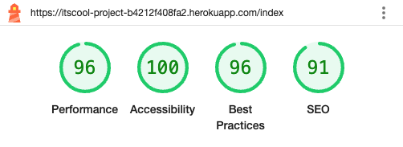     |  Meets criteria|
|Login         |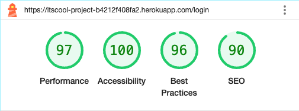     |  Meets criteria|                        
|Sign Up       |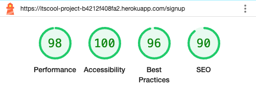    |  Meets criteria|                        
|Dashboard     |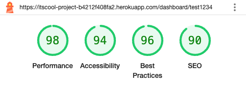 |  Meets criteria|                        
|Add slang     |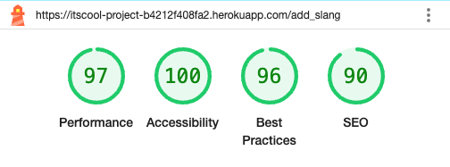 |  Meets criteria|                        
|Delete slang  |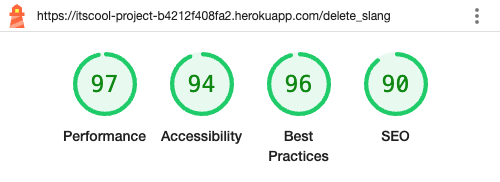    |  Meets criteria|                        
|404           |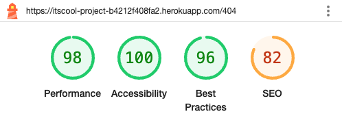       |  Meets criteria. Lower SEO but as a 404 page this is not too concerning|

## Responsiveness & Compatability Testing

 The below matrix shows the responsiveness and browser compatability testing carried out.

## Code Validation

The W3C Markup Validator and W3C CSS Validator Services were used to validate every page of the project to ensure there were no syntax errors in the project. The results and screenshots are in the table below.

| Page                 | Screenshot                                                                          | Notes                             |
|----------------------|-------------------------------------------------------------------------------------|-----------------------------------|
|index.html            |[view here](static/images/documents/testing/markup_validator/index.html_validator.png) | Passed | 
|login.html            |[view here](static/images/documents/testing/login.html_validator.png)                | Passed (error due to jinja tags)  |
|signup.html           |[view here](static/images/documents/testing/signup.html_validator.png)               |  |

|dashboard.html        |[view here](static/images/documents/testing/dashboard.html_validator1.png)           |         | 
|admin_dashboard.html  |[view here](static/images/documents/testing/admin_dashboard.html_validator.png)      | Passed  |
|add_slang.html        |[view here]()   | Passed /Failed| 
|delete_slang.html     |[view here]()   | Passed /Failed|
|404.html              |[view here]()   | Passed /Failed| 
|CSS                   |[view here]()   | Passed /Failed|

## Accesibility Testing

* The complete site was tested using [Web Aim](https://wave.webaim.org/) and has passed. This can be [viewed here for index.html]() and [viewed here for 404.html]().

## JavaScript Testing

### JS Hint

  * All JavaScript code was put though [JS Hint](https://jshint.com/) 

| Test      | Screenshot                                     | Notes                                                |
|-----------|------------------------------------------------|------------------------------------------------------|
| JS Hint       |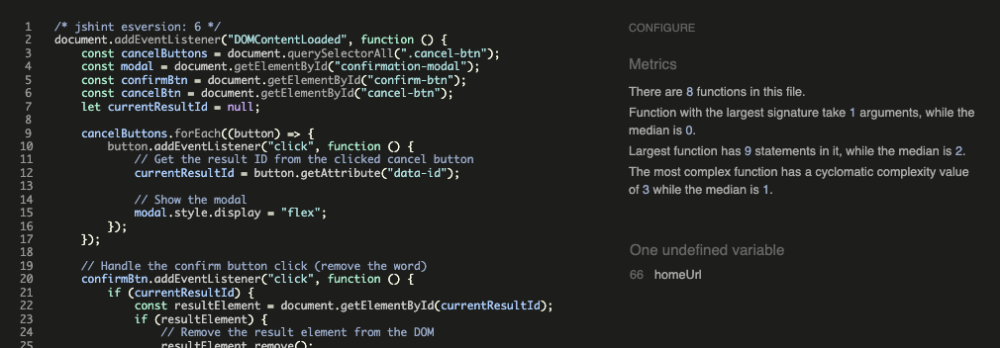      | Passed - No warnings. 1 undefined variable as expected. |

### Summary

 Shows an undefined variable in the script.js file. This variable is defined in a script tag in the 404.html file. For more information see [bug-fixes] section 

## Python Testing

### CI Python Linter

  * All Python code in app.py was put though [CI Python Linter](https://pep8ci.herokuapp.com/) and tested against a beautifier tool called [Code Beautify](https://codebeautify.org/python-formatter-beautifier#).

| Test      | Screenshot                                                                                   | Notes                                                |
|----------------------------|-----------------------------------------------------------------------------|------------------------------------------------------|
| CI python linter           |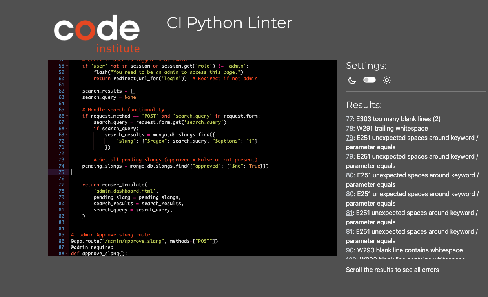 |  Initial testing showing white spaces, incorrect blank lines and some lines were too long.|
| CI python linter re-test 1 |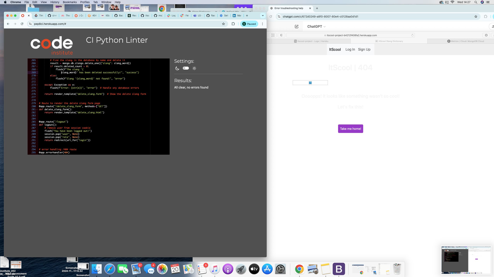    |  Passed - No warnings           | 
| Code Beutify               |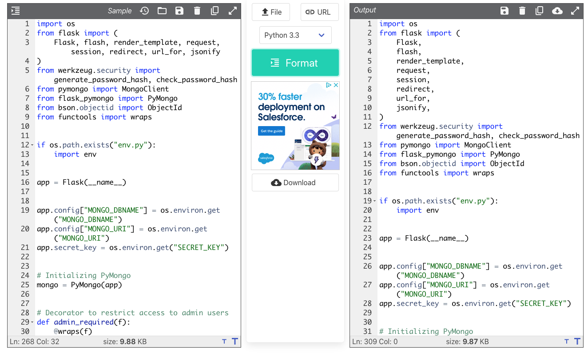      |  Made changes to line lengths and some indentation |
| CI python linter re-test 2 |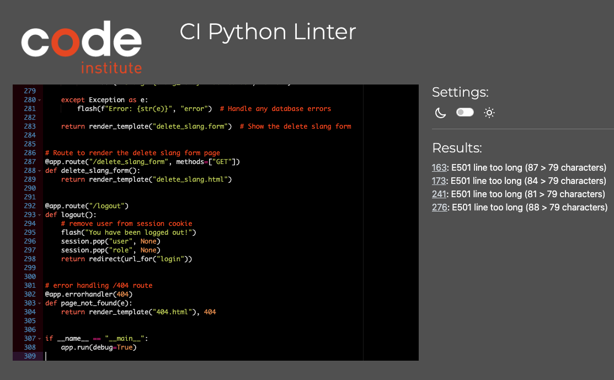        |  Indicated beautifier tool was not pep8 compliant with line lengths being too long |
| CI python linter re-test 3 |    |  Passed - No warnings   |

### Summary

After initially correcting the code format and it passing testing using the CI python linter it seemed that the indentation after breaking a line due to line length wasnt quite aesthetically correct, although meeting pep8 guidlines. The decision was made to use a python beautifier tool which then amended the code and changed the line lengths and indentations. To test if the beautifier tool was pep8 comliant the beautified code was re-run through the CI python linter which then logged warnings for some of the lines being too long. The app.py file was the reverted back to the tested and passed version that was verified by CI python linter, as this meant that  the beautifier tool was not pep8 compliant. As the criteria for this project is that python is to be pep8 compliant, using results and testing of the CI python linter was the most reliable approach.

## Fuzzywuzzy Testing

  * Initially the matching threshold was set to 80% whilst in development.
  * The function and installation was tested by entering random slang words that were stored in the database and by seeing what results were displayed as a match. 
  * At 80% threshold the user needs to be very accurate and close to the correct spelling of the slang word to get a close match. This does not align with the user stories.
  * The threshold was then reduced to 50% and tested in the same way again at 5% intervals. Between 50-65% the results were too broad and the matches were too 'fuzzy'. 
  * 70% match threshold seems to return close enough matches with enough tollerance and flexibility for spelling mistakes for all users.

## Bug Fixes

### 

### 

## Testing User Stories from User Experience (UX) Section

The project user stories have been met with the following features;

"**_As a guest user, I would like to_** _______________"
✅  browse through the slang terms listed alphabetically so I can see all the terms that are available.

   ItScool provides: 
      * .  
      * . 
      * .

       can be seen below.

✅  click on slang terms to view their definitions and sample usage, so I can understand the meaning and context.

   ItScool provides: 
      * . 
      * .

      can be seen below

✅  search for slang terms by typing keywords or phrases, so I can quickly find the slang term I'm interested in.

   ItScool provides: 
     * . 
     * .

✅  browse slang terms by selecting a letter from A-Z, so I can easily find terms that start with a specific letter.

   ItScool provides: 
     * . 

      is shown below.

✅  as a new user, create an account by providing a username and password, so I can log in and use additional features.

   ItScool provides: 
     * . 

      is shown below.

✅  read about the purpose of this slang dictionary, so I can understand the context and relevance of the terms listed.

  ItScool provides: 
     * 

"**_As a registered user, I would like to_** _______________"

✅  as a returning user, I want to log in with my username and password, so I can access my account.

  ItScool provides: 
      *  
      *.

✅  as a logged-in user, I want to update my profile details if necessary, so my account information is accurate.

  ItScool provides: 
     * .  
     * .

✅  get immediate feedback to know if I have signed up, logged in or signed out.

  ItScool provides: 
     * . 
     * .

      is shown below.

✅  access a user dashboard when logged in.

  ItScool provides: 
     * . 
     * .

✅  request to add new slang terms and definitions, so I can expand the slang dictionary and share knowledge.

  ItScool provides: 
      * . 
      * .

✅  to edit slang terms I’ve added to correct or improve definitions, ensuring the information stays accurate and up-to-date.

  ItScool provides: 
     

✅  request to delete slang terms that are no longer relevant or are duplicates, so the dictionary remains clean and useful.

  ItScool provides: 
     

"**_As an student user, I would like to_** _______________"

✅  Learn About Common School Slang:
    As a student, I want to browse slang terminology so I can understand the informal language and slang used by peers in the school environment and elsewhere.

  ItScool provides: 
     

✅  See Slang Organized Alphabetically:
    As a student, I want to see slang words organized by their first letter, so I can easily find terms that I hear frequently.

  ItScool provides: 
     

✅   Report Incorrect or Inappropriate Content:
    As a student, I want to report slang entries that are incorrect, outdated, or inappropriate, so I can help maintain a positive and accurate dictionary.

  ItScool provides: 
     

✅  Save Favourite Slang:
   As a student, I want to be able to save my favourite slang words to a favourites list in my user dashboard.

  ItScool provides: 
     

✅  Contribute School-Specific Slang:
    As a student, I want to contribute slang that’s specific to my age, school type or region, so I can share it with other students who may find it relevant or interesting.

  ItScool provides: 
     

"**_As a teacher or parent, I would like to_** _______________"

✅  Understand Student Language:
    As a teacher or parent, I want to look up slang terms and definitions, so I can understand the language students are using in social and school settings. 

  ItScool provides: 
     

✅  View Related Terms and Meanings:
    As a teacher or parent, I want to be able to search for slang words that i have heard and want to find out their corresponding definition and appropriateness.

  ItScool provides: 
     

✅  Browse by Letter or Category:
    As a teacher or parent, I want to browse slang by letter to find terms more easily and understand common slang patterns.

  ItScool provides: 
     

✅  Save Relevant Slang:
    As a teacher or parent, I want to be able to save slang words to a favourites list in my user dashboard that i can come back to as a reference point.

  ItScool provides: 
     

"**_As an administrator, I would like to_** _______________"

✅  review slang terms submitted by users before they are published, so I can ensure quality and appropriateness.

  ItScool provides: 
     

✅   manage user accounts, including editing and deleting accounts if needed, so I can enforce rules and maintain site integrity.

  ItScool provides: 
     

✅  edit or delete any slang term to correct inaccuracies, enforce content guidelines, and remove inappropriate entries.

  ItScool provides: 
     

✅  edit, delete or approve pending approval requests from users requesting a slang word to be added to the app via an admin     dashboard.

  ItScool provides: 
     

✅  search for slang words to be deleted from the app in the admin dashboard.

  ItScool provides: 
     

✅  use a form to add new slang words to the app.

  ItScool provides: 
     

✅  navigate easily to the admin dashboard via a navbar.

  ItScool provides: 
     

✅  

  ItScool provides: 
     

✅  

  ItScool provides: 
     

## Other Testing Methods

### Manual Testing

Behaviour driven Development (BDD) is where a project or product is tested to the user stories and by the user. This has also been done in responsiveness and compatability testing section above. 
This form of testing although useful in terms of user story testing can be subject to bias and sometimes things can get missed due to fatigue and is costly in time and resources. BDD is more user-centric and revolves around system behaviour. This is an Agile software development methodology.
It is particuarly useful as it can encompass a wide range of input from stakeholders to managers and is good for planning a project and monitoring throughout its entirety. Goals can be set along the projects way to delivery and measured.

- Below is a table of the manual user testing carried out.

| **Feature**          | **Test Details**           | **Expected results**                      | **Pass/Fail** |                                             
| :-- | :-- | :-- | :-- |

### Automated Testing

Test Driven Development (TDD) is where developers test first and use these results to guide theor development. The process begins when tests are written in order to fail but only so much so that the tests dont break the programme. TDD is thought of as more developer-centric, and is revolves around code correctness.

A popular technique in TDD is Red-Green-Refactor. TDD is a manageable way of testing code breaking it down into manageable chunks. This is explained below;
Red - Write a failing test. Script a test that will fail around a specific function of the programme.
Green - Make the test pass, enough needs to be done to get it to pass and work
Refactor - Clean up the code. Refining the code is done making it efficient and reliable. 

An example of automated testing for this project would be;

-Red - A test is written for Background image does not change on start game button being clicked.

-Green - Add background image function with event listeners to the start game button so background changes on click. 

-Refactor - Tidy code up and minimise where possible. Check reliability. Revisit when more functions or event listeners are added, or the original function is extended. Monitor.

Various language specific frameworks are available to run automated testing. One of the most popular is Jest for testing JavaScript. 

It is best to combine manual and automated testing. Automated tests will not test user experience and tests will only ever be as good as the questions we ask it to perform.

## Further Testing

 * A large amount of testing was carried out to ensure that all pages, buttons, feedback and functions were working correctly.
 * Friends and family members were asked to review the site and documentation to point out any bugs and/or user 
      experience issues. 