 #[Testing](#testing)

## Table of contents

  1. [**Overall Peformance**](#overall-performance)
  2. [**Code Validation**](#code-validation)
  3. [**Accessibility Testing**](#accessibility-testing)
  4. [**Responsiveness & Compatability Testing**](#responsiveness--compatability-testing)
  5. [**JavaScript Testing**](#javascript-testing)
  6. [**Python Testing**](#python-testing)
        - **JS Hint**
  7. [**Fuzzywuzzy**](#fuzzywuzzy-testing)
  8. [**Bug Fixes**](#bug-fixes)
  9. [**Testing User Stories from User Experience (UX) Section**](#testing-user-stories)
        - **Project Goals**
        - **User Goals**
        - 
  10. [**Other Testing Methods**](#other-testing)
  11. [**Further Testing**](#further-testing)

  ------

## Overall Performance

The complete site was tested on the lighthouse facility in Google Developer Tools to assess the overall performance of the site. The site meets the pass criteria and you can see the results in the below table.

| Page         | Screenshot                                                      | Notes          |
|--------------|-----------------------------------------------------------------|----------------|
| Index Page |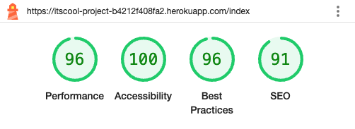  |  Meets criteria|
|Login   |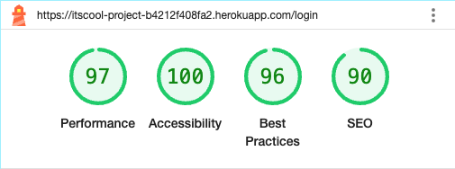 |  Meets criteria|                        
| Sign Up |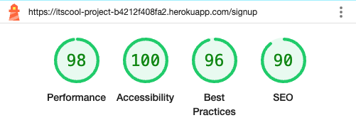 |  Meets criteria|                        
|User Dashboard |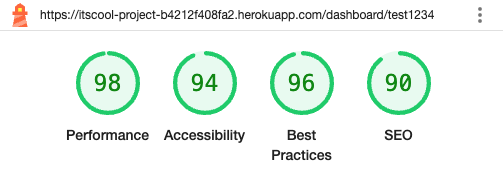 |  Meets criteria |                        
| Add slang |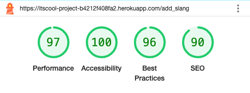 |  Meets criteria |                        
| Delete slang  |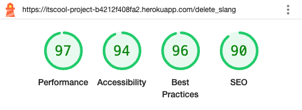    |  Meets criteria|
| Admin Dashboard |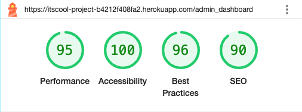    |  Meets criteria |                         
|404       |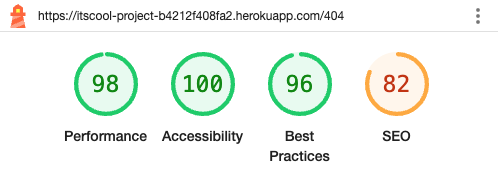       |  Meets criteria. Lower SEO but as a 404 page this is not too concerning |

------

## Responsiveness & Compatability Testing

To ensure a broad range of users can successfully use this site, I tested it across the 5 major browsers in both desktop and mobile configuration.

- Chrome *v.74*
- Edge *v.18*
- Firefox *v.67*
- Safari *v.12*
- Opera n/a
- Internet Explorer *v.11*

For testing compatibility, I created a testing matrix to test across multiple devices and browsers. The test matrix can be found seen below.

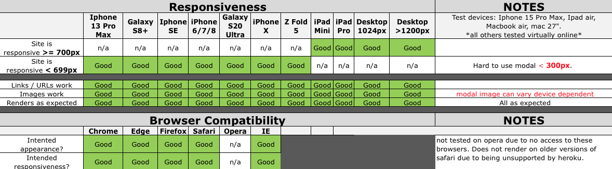

------

## Code Validation

The W3C Markup Validator and W3C CSS Validator Services were used to validate every page of the project to ensure there were no syntax errors in the project. The results and screenshots are in the table below.

| Page                 | Screenshot Link                                                                   | Notes  |
|----------------------|-----------------------------------------------------------------------------------|--------|
|index.html            |[view here](documents/testing/markup_validator/index.html_validator.png)           | Passed | 
|login.html            |[view here](documents/testing/markup_validator/login.html_validator.png)           | Passed |
|signup.html           |[view here](documents/testing/markup_validator/signup.html_validator.png)          | Passed |
|dashboard.html        |[view here](documents/testing/markup_validator/dashboard.html_validator.png)       | Passed | 
|admin_dashboard.html  |[view here](documents/testing/markup_validator/admin_dashboard.html_validator.png) | Passed |
|add_slang.html        |[view here](documents/testing/markup_validator/add_slang.html_validator.png)       | Passed | 
|delete_slang.html     |[view here](documents/testing/markup_validator/delete_slang.html_validator.png)    | Passed |
|404.html              |[view here](documents/testing/markup_validator/404.html_validator.png)             | Passed |
|CSS                   |[view here](documents/testing/markup_validator/w3c_css.png)   | Passed. Warnings due to root variables not able to be tested|

##### back to [top](#table-of-contents)

------

## Accesibility Testing

* The complete site was tested using [Web Aim](https://wave.webaim.org/) and has passed. The links are available in the below table.

| Page                 | Screenshot                                                            | Notes  |
|----------------------|-----------------------------------------------------------------------|--------|
|index.html            |[view here](documents/testing/webaim/webaim_index_pass.png)                   | Passed | 
|login.html            |[view here](documents/testing/webaim/webaim_login.png)                        | Passed |
|signup.html           |[view here](documents/testing/webaim/webaim_signup.png) | Passed |
|add_slang.html        |[view here](documents/testing/webaim/webaim_add_slang.png)                    | Passed | 
|delete_slang.html     |[view here](documents/testing/webaim/webaim_remove_slang.png)                 | Passed |
|404.html              |[view here](documents/testing/webaim/webaim_404.png)                          | Passed - alt text query(minor)| 
|dashboard.html   |[view lighthouse testing here](documents/testing/lighthouse/dashboard_lighthouse.png) | Can only be tested in lighthouse due to login required. Not supported by webaim. |
|admin_dashboard.html  |[view lighthouse testing here](documents/testing/lighthouse/admin_dashboard_lighthouse.png) | Can only be tested in lighthouse due to login required. Not supported by webaim. |

------

## JavaScript Testing

### JS Hint

  * All JavaScript code was put though [JS Hint](https://jshint.com/) 

| Test      | Screenshot                                              | Notes                                                   |
|-----------|---------------------------------------------------------|---------------------------------------------------------|
| JS Hint   |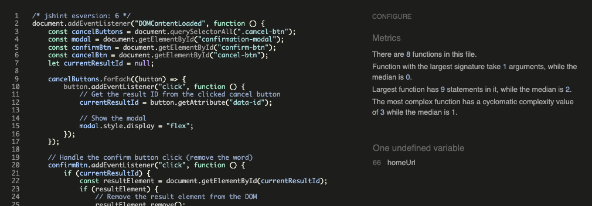      | Passed - No warnings. 1 undefined variable as expected. |

### Summary

 Shows an undefined variable in the script.js file. This variable is defined in a script tag in the 404.html file. For more information see bug fix section in the [development](DEVELOPMENT.md).

------

## Python Testing

### CI Python Linter

  * All Python code in app.py was put though [CI Python Linter](https://pep8ci.herokuapp.com/) and tested against a beautifier tool called [Code Beautify](https://codebeautify.org/python-formatter-beautifier#).

| Test      | Screenshot                                                                                   | Notes                                                |
|----------------------------|-----------------------------------------------------------------------------|------------------------------------------------------|
| CI python linter           |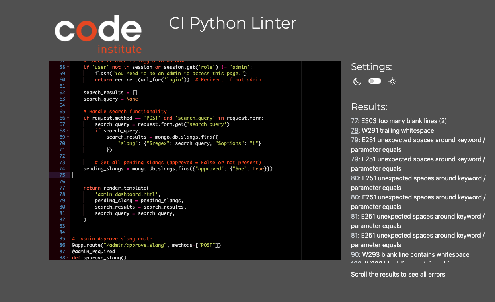 |  Initial testing showing white spaces, incorrect blank lines and some lines were too long.|
| CI python linter re-test 1 |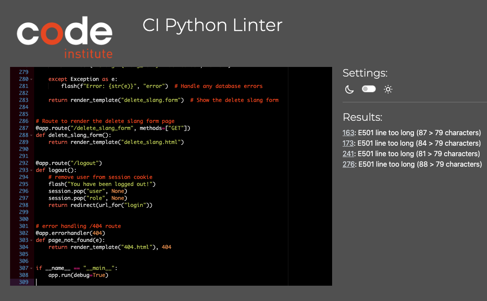    |  Passed - No warnings           | 
| Code Beutify               |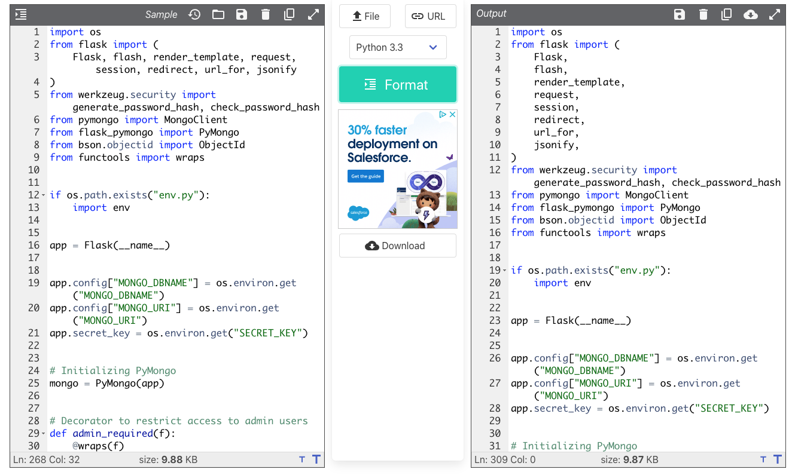      |  Made changes to line lengths and some indentation |
| CI python linter re-test 2 |        |  Indicated beautifier tool was not pep8 compliant with line lengths being too long |
| CI python linter re-test 3 |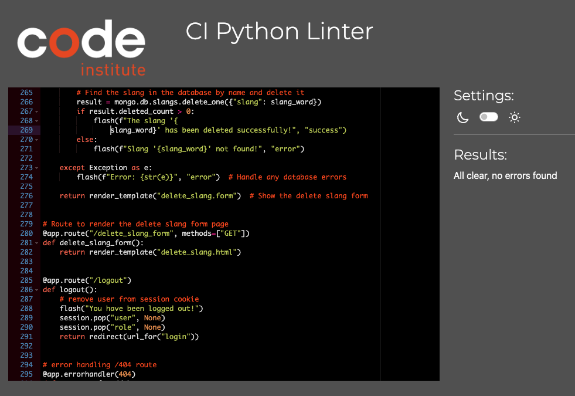    |  Passed - No warnings   |

### Summary

After initially correcting the code format and it passing testing using the CI python linter it seemed that the indentation after breaking a line due to line length wasnt quite aesthetically correct, although meeting pep8 guidlines. The decision was made to use a python beautifier tool which then amended the code and changed the line lengths and indentations. To test if the beautifier tool was pep8 comliant the beautified code was re-run through the CI python linter which then logged warnings for some of the lines being too long. The app.py file was the reverted back to the tested and passed version that was verified by CI python linter, as this meant that  the beautifier tool was not pep8 compliant. As the criteria for this project is that python is to be pep8 compliant, using results and testing of the CI python linter was the most reliable approach.

##### back to [top](#table-of-contents)

------

## Fuzzywuzzy Testing

  * Initially the matching threshold was set to 80% whilst in development.
  * The function and installation was tested by entering random slang words that were stored in the database and by seeing what results were displayed as a match. 
  * At 80% threshold the user needs to be very accurate and close to the correct spelling of the slang word to get a close match. This does not align with the user stories.
  * The threshold was then reduced to 50% and tested in the same way again at 5% intervals. Between 50-65% the results were too broad and the matches were too 'fuzzy'. 
  * 70% match threshold seems to return close enough matches with enough tollerance and flexibility for spelling mistakes for all users.

## Bug Fixes

  * please see the [development](DEVELOPMENT.md) file for bug fix information.

------

## Testing User Stories from User Experience (UX) Section

The project user stories have been met with the following features;

"**_As a guest user, I would like to_** _______________"

✅  browse through the slang terms listed alphabetically so I can see all the terms that are available.

   ItScool provides: 
      * a bootstrap accordion of all slangs listed alphabetically on all devices.  
      * expandable accordion headings revealing slang words starting with the corresponding letter.  
      * correspoding defintions in the accordion next to each slang word. 

       The accordion can be seen below.

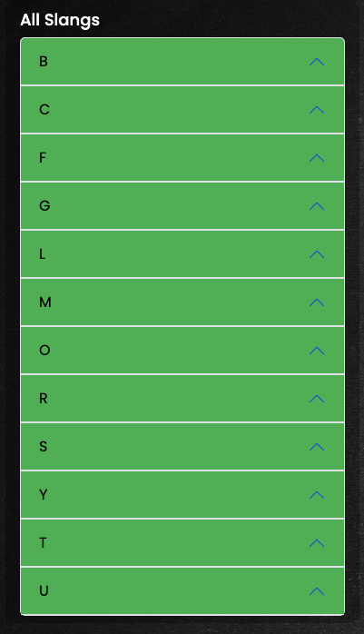

✅  click on slang terms to view their definitions and sample usage, so I can understand the meaning and context.

   ItScool provides: 
      * a bootstrap accordion which when clicked, reveals slang words listed with their corresponding definitions. Viewable [here](documents/readme/accordion.png). 

✅  search for slang terms by typing keywords or phrases, so I can quickly find the slang term I'm interested in.

   ItScool provides: 
    * A search bar enabling the user to search for slang terms, that are relevance from partial matching using fuzzywuzzy. This displays partial match results due to the nature of slang spellings. This can be seen [here](documents/readme/search_function.png). 
    * A search result area displaying the results of the search. Viewable [here](documents/readme/search_results.png).

✅  browse slang terms by selecting a letter from A-Z, so I can easily find terms that start with a specific letter.

   ItScool provides: 
     * a bootstrap accordion of all slangs listed alphabetically on all devices. The accordion can be seen [here](documents/readme/accordion.png).

✅  as a new user, create an account by providing a username and password, so I can log in and use additional features.

   ItScool provides: 
     * a signup page for users to register as a user with a signup form. 
     * This function is a create part of CRUD functionality for this project. It allows the user to create a profile with a username and password.

     Signup page is shown below.

------

"**_As a registered user, I would like to_** _______________"

✅  as a returning user, I want to log in with my username and password, so I can access my account. 

  ItScool provides: 
      * a login page for users to login with their username and password. 
      * a flash message letting users know they are logged in. 

✅  as a logged-in user, I want to log out of my account, so I can ensure my account remains secure on shared devices.

  ItScool provides: 
    * a link in the navbar for both users and admin users to log out with one click. These can be seen below. 

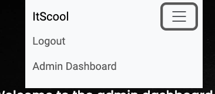
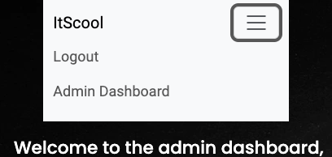

✅  get immediate feedback to know if I have signed up, logged in or signed out.

  ItScool provides: 
     * Immediate feedback via a flash message to let users know they have signd up successfully. 
     * Immediate feedback via a flash message to let users know they have logged in successfully. 
     * Immediate feedback via a flash message to let users know they have logged out successfully. 

    Example of a flash message is shown below.

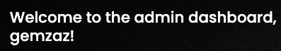

✅  access a user dashboard when logged in.

  ItScool provides: 
     * a user dashboard for logged in users accessible via the navbar as required. 

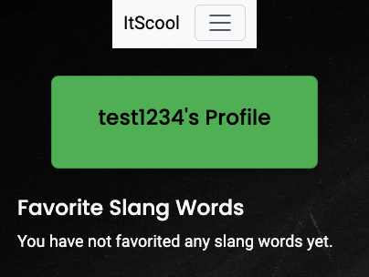

✅  request to add new slang terms and definitions, so I can expand the slang dictionary and share knowledge.

  ItScool provides: 
      * A navigation link to a add slang word request form in the navbar 
      * A add slang page with a add slang word request for for logged in users. 

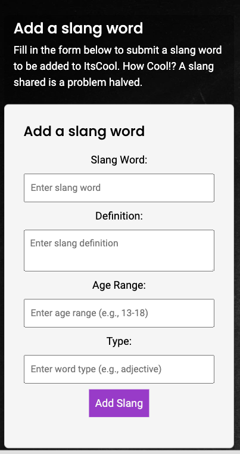

✅  request to edit slang terms I’ve added to correct or improve definitions, ensuring the information stays accurate and up-to-date.

  ItScool provides: 
      * A add slang form where any slang or revision of slang will be reviewed by admin to update appropriately. 
      * This is the update functionality within the CRUD functionality. This can be seen [here](documents/readme/add_slang.png). 

✅  request to delete slang terms that are no longer relevant or are duplicates, so the dictionary remains clean and useful.

  ItScool provides: 
      * A delete slang page for logged in users which can be navigated to in the navbar. 
      * Delete slang form on the delete slang page that once submitted is subject to review by admin. This is part of the delete functionality within CRUD. 
     
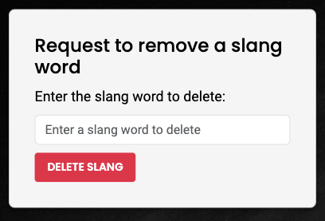

✅   be able to save my favourite slang words to a favourites list in my user dashboard.

    ItScool provides: 
      * A heart shaped favourite button that allows users to add favourite slang words to be added to a favourites list in their user profile dashboard page. 
      * Favourite buttons located in both the accordion and search results sections, next to slang words. These can be seen below. 
     
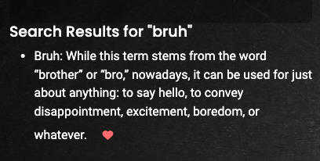
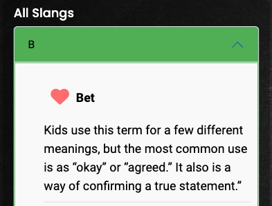

------

"**_As an student user, I would like to_** _______________"

✅  Learn About Common School Slang:
    As a student, I want to browse slang terminology so I can understand the informal language and slang used by peers in the school environment and elsewhere.

  ItScool provides: 
      * A bootstrap accordion where students can browse slang words and their corresponding terminology, seen [here](documents/readme/accordion.png). 
      * A search bar enabling the user to search for slang terms, that are benefot from partial matching using fuzzywuzzy. This displays partial match results due to the nature of slang spellings. This can be seen [here](documents/readme/search_function.png). 
      * A search result area displaying the results of the search. Viewable [here](documents/readme/search_results.png).
     

✅  Contribute School-Specific Slang:
    As a student, I want to contribute slang that’s specific to my age, school type or region, so I can share it with other students who may find it relevant or interesting. 

  ItScool provides: 
    * A add slang page where users can add slang words that, pending approval, will be added to the dictionary allowing users to contribute, making the concept user centric. This can be seen [here](documents/readme/add_slang.png). 
    
✅  See Slang Organized Alphabetically:
    As a student, I want to see slang words organized by their first letter, so I can easily find terms that I hear frequently. 

  ItScool provides: 
      * A bootstrap accordion where students can browse slang words and their corresponding terminology grouped by the letter they begin with. This can be seen [here](documents/readme/accordion.png). 

✅   Report Incorrect or Inappropriate Content:
    As a student, I want to report slang entries that are incorrect, outdated, or inappropriate, so I can help maintain a positive and accurate dictionary. 

  ItScool provides: 
      * A delete slang word page where users can request a slang word and its related fields to be deleted from the dictionary if a users feels it is incorrect or innapropriate for the user groups. 
      * A clearly labelled delete slang page which can be navigated to from the nav bar. 
      * A simple, clear delete slang form that takes the slang word to be deleted and submits it to admin for approval. 
     
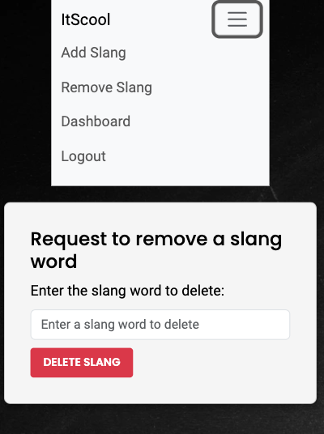

✅  Save Favourite Slang:
   As a student, I want to be able to save my favourite slang words to a favourites list in my user dashboard. 

  ItScool provides: 
      * A heart shaped favourite button that allows users to add favourite slang words to be added to a favourites list in their user profile dashboard page. 
      * Favourite buttons located in both the accordion and search results sections, next to slang words. These can be seen below. 
     

##### back to [top](#table-of-contents)

------

"**_As a teacher or parent, I would like to_** _______________"

✅  Understand Student Language:
    As a teacher or parent, I want to look up slang terms and definitions, so I can understand the language students are using in social and school settings. 

  ItScool provides: 
    * A search bar enabling the user to search for slang terms, that are benefot from partial matching using fuzzywuzzy. This displays partial match results due to the nature of slang spellings. This can be seen [here](documents/readme/search_function.png). 
    * A search result area displaying the results of the search. Viewable [here](documents/readme/search_results.png). 
    * A bootstrap accordion enabling the user to browse slang terms that they may find relevant or may be looking for. This can be seen [here](documents/readme/accordion.png). 

✅  View Related Terms and Meanings:
    As a teacher or parent, I want to be able to search for slang words that i have heard and want to find out their corresponding definition and appropriateness.

  ItScool provides: 
    * A search bar enabling the user to search for slang terms, that are benefot from partial matching using fuzzywuzzy. This displays partial match results due to the nature of slang spellings. This can be seen [here](documents/readme/search_function.png). 
    * A search result area displaying the results of the search. Viewable [here](documents/readme/search_results.png). 
     

✅  Browse by Letter or Category:
    As a teacher or parent, I want to browse slang by letter to find terms more easily and understand common slang patterns.

  ItScool provides: 
     * a bootstrap accordion of all slangs listed alphabetically on all devices. The accordion can be seen [here](documents/readme/accordion.png).

✅  Save Relevant Slang:
    As a teacher or parent, I want to be able to save slang words to a favourites list in my user dashboard that i can come back to as a reference point.

  ItScool provides: 
    * a favourites list for logged in and registered users available in the user dashboard. 
    * favourite buttons to allow logged in and registered users to add favourite slangs to their favourites list. 
     
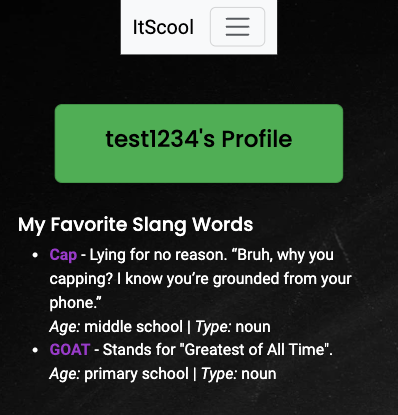

##### back to [top](#table-of-contents)

------

"**_As an administrator, I would like to_** _______________"

✅  review slang terms submitted by users before they are published, so I can ensure quality and appropriateness.

  ItScool provides: 
    * a pending slang list where users have submitted request for slangs to be added to the dictionary by submitting the add slang form for users.
    * Action button allowing the admin user to take appropriate action.
     
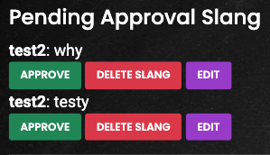

✅  delete any slang term to correct inaccuracies, enforce content guidelines, and remove inappropriate entries.

  ItScool provides: 
    * an admin search function allowing admin to search slang words they wish to remove from the dictionary. This can be seen below. 
    * a confirmation modal to ensure admin confirm that they want to delete the slang entry, minimising mistakes. This can be seen [here](documents/readme/delete_nav.png). 
     

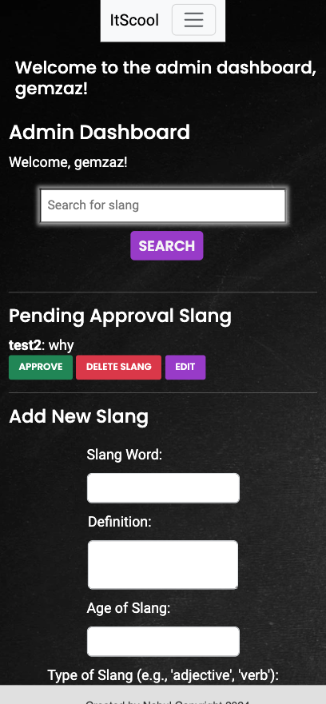

✅  edit, delete or approve pending approval requests from users requesting a slang word to be added to the app via an admin dashboard.

  ItScool provides: 
    * action buttons allowing the admin user to add, delete or edit a pending slang. 
    * an edit button that triggers an edit modal enabling the admin user to edit the pending slang before approval. This can be seen [here](documents/readme/edit_modal.png). 
     

✅  use a form to add new slang words to the app.

  ItScool provides: 
    * an add slang form located in the admin dashboard where the admin can add a slang term and its corresponding fields without having to submit it for approval, streamlining the process for admin.
     

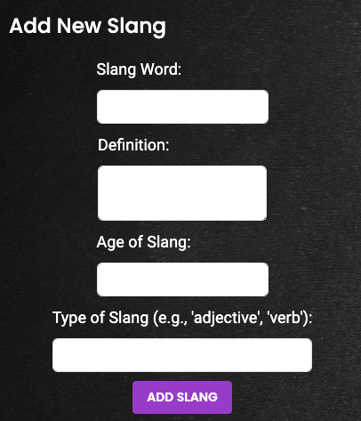

✅  navigate easily to the admin dashboard via a navbar.

  ItScool provides: 
    * a navbar specifically for admin users, which can be seen below. 
     

##### back to [top](#table-of-contents)

------

## Other Testing Methods

### Manual Testing

Behaviour driven Development (BDD) is where a project or product is tested to the user stories and by the user. This has also been done in responsiveness and compatability testing section above. 
This form of testing although useful in terms of user story testing can be subject to bias and sometimes things can get missed due to fatigue and is costly in time and resources. BDD is more user-centric and revolves around system behaviour. This is an Agile software development methodology.
It is particuarly useful as it can encompass a wide range of input from stakeholders to managers and is good for planning a project and monitoring throughout its entirety. Goals can be set along the projects way to delivery and measured.

- Below is a table of the manual user testing carried out.

| **Feature**          | **Test Details**           | **Expected results**                      | **Pass/Fail** |                                             
| :-- | :-- | :-- | :-- |
| ItScool Nav Link | Click to redirect to index page | Links to start page, except when modal displayed | Pass |
| Signup Nav Link | Click to direct to signup page | Links to signup page, except when modal displayed or logged in| Pass |
| Login Nav Link | Click to direct to Login page | Links to login page, except when modal displayed and currently logged in | Pass |
| Logout Nav Link | Click to logout | Logs out unless already logged out. redirects to login page | Pass |
| User Dashboard nav link | Click to direct to user dashboard | Links to user dashboard, visible when logged in as user | Pass |
| Add Slang Nav Link | Click to direct to add slang page| Links to add slang, visible when logged in as user | Pass |
| Remove Slang Nav Link | Click to direct to remove slang page| Links to remove slang, visible when logged in as user | Pass |
| Admin Dashboard Nav Link | Click to direct to admin dashboard | Links to admin dashboard, visible when logged in as admin | Pass |
| Index Search Slang | Enter a slang word verified in database, enter close match | Displays exact or close match with related fields | Pass |
| Accordion | Click headings and check verified slangs appear to all users | Displays slangs when expanded grouped by letter under relevant headings | Pass |
| Sign Up | Create user name and password, attempt login | Creates username and password. Logs in | Pass |
| Log In | Attempt login with username and password used for signup | Logs in with registered credentials | Pass |
| Logout | Click link in admin and user navbar | Logs user out and redirects to login page | Pass |
| Sign Up & Login Link | Click links to direct to relevant page | Links to relevant page | Pass |
| Sign Up | create user name and password, attempt login | Creates username and password. Logs in | Pass |
| Add Slang | Input slang to be verified | Input appears in the admin dashboard pending slangs list | Pass |
| Delete Slang | search slang to be deleted and click remove button, approve in confirmation modal | Returns close matches and modal shows on click of delete button | Pass |
| User Dashboard Profile | Login as user and navigate to userdashboard | User dashboard displays username in the profile card | Pass |
| Favourite Button | Click favourite button on search results and accordion slang items on index page. | Slang appears in favourites list in user dashboard | Pass |
| Admin Dashboard | Navigate to admin dashboard, check for flash message | Flash message appears in dashboard when navigated to | Pass |
| Admin Delete Slang | Input slang to delete, select from results and use confirmation modal to confirm. Re-search for deleted slang | Returns close matches, modal shows when delete button is clicked and removes from app, verified on re search | Pass |
| Admin Pending Slangs | Add slang as user, log in as admin to check updated list | Request is shown in the pending slangs list and updates | Pass |
| Admin Action Button (Approve) | Click approval button, check success by searching for approved slang. | Flash message appears with success. Slang is added to database | Pass |
| Admin Action Button (Delete) | Click delete button, confirm in modal. | Confirming deletion removes slang from pending list and database | Pass |
| Admin Action Button (Edit) | Click edit button |  Edit modal triggered and shows | Pass |
| Admin Edit Modal | Enter input to edit pending slang, confirm or cancel | Pending slang is updated with edits upon saving changes, modal shuts upon clicking close button | Pass |
| Add Slang Admin | Enter input to add slang | Search for new slang added using search bar | Pass |
| Confirmation Modal | click delete slang button in admin dashboard & delete slang user form | Modal confirms with success message and closes upon clicking close button | Pass |
| Auto date change in footer | Check year is present and correct on loading | Shows current year in span in footer | Pass |
| 404 Page | Type unknown url extention in browser | Page loads when a page cannot be found or error occurs | Pass |
| 404 take me home button | Click take me home button | Redirects to index and links to index.html page on click | Pass |
| 404 redirect | Check redirect after 10 seconds of inactivity | Redirects to index after 10 seconds | Pass |

##### back to [top](#table-of-contents)

------

### Automated Testing

Test Driven Development (TDD) is where developers test first and use these results to guide theor development. The process begins when tests are written in order to fail but only so much so that the tests dont break the programme. TDD is thought of as more developer-centric, and is revolves around code correctness.

A popular technique in TDD is Red-Green-Refactor. TDD is a manageable way of testing code breaking it down into manageable chunks. This is explained below;
Red - Write a failing test. Script a test that will fail around a specific function of the programme.
Green - Make the test pass, enough needs to be done to get it to pass and work
Refactor - Clean up the code. Refining the code is done making it efficient and reliable. 

An example of automated testing for this project would be;

-Red - A test is written for Background image does not change on start game button being clicked.

-Green - Add background image function with event listeners to the start game button so background changes on click. 

-Refactor - Tidy code up and minimise where possible. Check reliability. Revisit when more functions or event listeners are added, or the original function is extended. Monitor.

Various language specific frameworks are available to run automated testing. One of the most popular is Jest for testing JavaScript. 

It is best to combine manual and automated testing. Automated tests will not test user experience and tests will only ever be as good as the questions we ask it to perform.

## Further Testing

 * A large amount of testing was carried out to ensure that all pages, buttons, feedback and functions were working correctly.

 * Friends and family members were asked to review the site and documentation to point out any bugs and/or user 
      experience issues.

  ### School Testing

  * The app was tested by a local primary school where family attend. Staff member were asked for feedback on the concept, design, experience and additional functionalities desired. Here is theor summary to be considered for future development...

  'Thank you for asking us to review this project. Several members of staff have had a look at this and found it useful. We all agreed that we had not seen anything like this before and to us it is a totally new concept. The overall design is easy to use, and we feel it is appropriate for children and adults that would possibly want to use it. We liked the design, especially the blackboard design. We also liked the colours. Although some of our students may be too young to use it we feel that students aged 10+ would be able to use it without much supervision subject to how content is monitored.
   As teachers professionally and some of us as parents, we feel it would be useful both in a school setting and recreationally. We particuarly liked the heart button and favourites list. 
   Our constructive criticism is that it would be nice if you could take off a word and definition from the list. As teachers it would also be nice to be able to add our thoughts about a word and perhaps a teachers area, community and discussion thread would be very good. Maybe like a forum? We hope you find this feedback useful and look forward to looking at the finished product'.

##### back to [top](#table-of-contents)